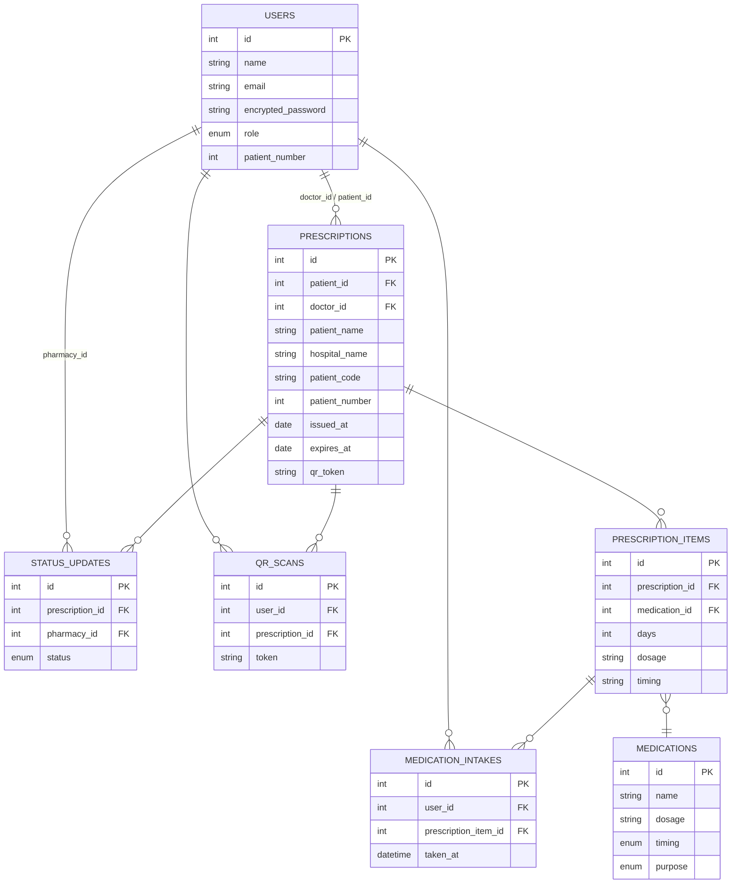

# Medication Manager
# 処方箋管理アプリ (Medication Manager)

## 概要
本アプリは、**医師・薬局・患者**の3者をつなぐ処方箋管理システムです。  
処方箋を **QRコード** で安全に受け渡しし、患者がアプリを通じて処方内容を確認でき、  
さらに **服薬表示機能** によって服薬をカレンダーに表示し飲み忘れ防止させることを目的としています。  

---

## ユーザーと役割
- **医師 (Doctor)**
  - 薬の登録
  - 患者に処方箋を発行
  - 処方箋を患者に渡す（QRコード） 

- **薬局 (Pharmacy)**
  - 患者の処方箋を受付（QRコード） 
  - 調剤ステータスを更新（受付中 → 調剤中 → 受け渡し済み）  

- **患者 (Patient)**
  - 処方箋を受け取り、薬局で提示（QRコード） 
  - 処方内容とステータスを確認
  - 受け取った薬の服用タイミングと残量をカレンダーで確認 

---

## テスト用アカウント
- **医師 (Doctor)**
  - 名前 医師太郎
  - 病院名 テスト病院
  - ログイン用メールアドレス doctor@icloud.com
  - パスワード 123456 

- **薬局 (Pharmacy)**
  - 薬局名 テスト薬局
  - ログイン用メールアドレス pharmacy@icloud.com
  - パスワード 123456  

- **患者 (Patient)**
  - 名前 患者太郎
  - ユーザー番号 ３
  - ログイン用メールアドレス patient@icloud.com
  - パスワード 123456

---

---
## データベース設計

### ApplicationRecord モデル設計図
【役割】  
・全てのモデルの基底クラス（直接テーブルを持たない）  
・共通設定や共通メソッドを追加する場合に使用  

【補足】  
・Rails で自動生成される抽象クラス  
・テストは基本不要（共通メソッドを追加した場合のみテスト対象）  

---

### Prescription モデル設計図
【関連付け】  
・patient : User に所属（必須）  
・doctor : User に所属（必須）  
・prescription_items : 複数保持、削除時に連動して削除  
・medications : prescription_items を経由して関連  
・status_updates : 複数保持、削除時に連動して削除  
・qr_scans : 複数保持、削除時に連動して削除  

【バリデーション】  
・patient_id : 必須  
・doctor_id : 必須  
・hospital_name : 必須  
・issued_at : 必須  
・expires_at : 必須  
・qr_token : 必須、一意性あり  
・patient_name : 必須、50文字以内  

【日付整合性】  
・expires_at は issued_at より後でなければならない  

【処方箋アイテム必須】  
・prescription_items が最低1件必要  
・存在しない場合は「処方箋アイテムを入力してください」というエラー  

【補足】  
・accepts_nested_attributes_for :prescription_items, allow_destroy: true  
・フォームから処方薬情報をまとめて登録・更新できる  

#### Prescription テーブル設計（カラム一覧）
・id : 主キー  
・patient_id : 患者ユーザーの ID（必須）  
・doctor_id : 医師ユーザーの ID（必須）  
・patient_name : 患者名（必須、50文字以内）  
・hospital_name : 病院名（必須）  
・patient_code : 任意、患者コード（NULL 許可）  
・patient_number : 任意、患者番号（NULL 許可）  
・issued_at : 処方箋の発行日（必須）  
・expires_at : 処方箋の有効期限（必須、発行日より後）  
・qr_token : QRコード用の一意なトークン（必須、一意制約あり）  
・created_at : 作成日時（Rails 自動付与）  
・updated_at : 更新日時（Rails 自動付与）  

---

### PrescriptionItem モデル設計図
【関連付け】  
・prescription : Prescription に所属（必須）  
・medication : Medication に所属（必須）  
・medication_intakes : 複数保持、削除時に連動して削除  

【バリデーション】  
・days : 必須、整数のみ、1以上でなければならない  

【補足】  
・処方箋に含まれる「薬ごとの内訳」を管理  
・どの薬を何日分出すかを記録  
・投与量（dosage）やタイミング（timing）は任意入力  

#### PrescriptionItems テーブル設計（カラム一覧）
・id : 主キー  
・prescription_id : 処方箋 ID（必須、FK）  
・medication_id : 薬 ID（必須、FK）  
・days : 投薬日数（必須、整数、1以上）  
・dosage : 投与量（任意、例: "1錠"）  
・timing : 投与タイミング（任意、例: "朝食後"）  
・created_at : 作成日時（Rails 自動付与）  
・updated_at : 更新日時（Rails 自動付与）  

---

### Medication モデル設計図
【関連付け】  
・image : ActiveStorage で1つの画像を添付可能  

【列挙型（enum）】  
・timing : 服用タイミング（morning, noon, evening, bedtime, after_meal）  
・purpose : 薬の目的（unspecified, antipyretic, analgesic, stomach, antibiotic）  

【バリデーション】  
・name : 必須  
・dosage : 必須  
・timing : 必須  
・purpose : 必須  
・image : 添付必須（未添付ならエラー）  

【補足】  
・薬の基本情報を管理するモデル  
・用途や服用タイミングを enum で管理可能  

#### Medication テーブル設計（カラム一覧）
・id : 主キー  
・name : 薬名（必須）  
・dosage : 投与量（必須）  
・timing : 服用タイミング（必須、enum）  
・purpose : 薬の目的（必須、enum、デフォルト unspecified）  
・created_at : 作成日時（Rails 自動付与）  
・updated_at : 更新日時（Rails 自動付与）  
・image : ActiveStorage 経由で管理（別テーブル）  

---

### MedicationIntake モデル設計図
【関連付け】  
・user : User に所属（必須）  
・prescription_item : PrescriptionItem に所属（必須）  

【バリデーション】  
・taken_at : 必須（服薬日時）  

【補足】  
・ユーザーが「薬をいつ飲むか」を記録するモデル  
・処方薬（PrescriptionItem）に紐づいて管理される  

#### MedicationIntakes テーブル設計（カラム一覧）
・id : 主キー  
・user_id : ユーザー ID（必須、FK）  
・prescription_item_id : 処方薬アイテム ID（必須、FK）  
・taken_at : 服薬日時（必須）  
・created_at : 作成日時（Rails 自動付与）  
・updated_at : 更新日時（Rails 自動付与）  

---

### User モデル設計図
【関連付け】  
・doctor_prescriptions : Prescription を複数保持（doctor_id 経由、削除時に連動して削除）  
・patient_prescriptions : Prescription を複数保持（patient_id 経由、削除時に連動して削除）  
・status_updates : 複数保持（pharmacy_id 経由、削除時に連動して削除）  
・qr_scans : 複数保持、削除時に連動して削除  
・medication_intakes : 複数保持、削除時に連動して削除  

【列挙型（enum）】  
・role : ユーザーの役割を区別（doctor, pharmacy, patient）  

【バリデーション】  
・name : 必須  
・email : 必須、一意性あり  
・patient_number : 一意性あり、整数のみ（nil 許可）  

【コールバック】  
・患者ユーザー作成時、patient_number を自動採番  
（既存の最大番号 +1 を付与）  

#### Users テーブル設計（カラム一覧）
・id : 主キー  
・name : 名前（必須）  
・email : メールアドレス（必須、一意制約あり）  
・encrypted_password : Devise による暗号化パスワード  
・role : ユーザー種別（必須、enum: doctor=0, pharmacy=1, patient=2）  
・patient_number : 患者番号（任意、整数、一意制約あり、自動採番）  
・created_at : 作成日時（Rails 自動付与）  
・updated_at : 更新日時（Rails 自動付与）  

---

### StatusUpdate モデル設計図
【関連付け】  
・prescription : Prescription に所属（必須）  
・pharmacy : User に所属（任意、薬局アカウントのみ）  

【列挙型（enum）】  
・status : 処方箋の進行状況を表す（整数で管理）  
・ pending : 患者保有  
・ accepted : 受付済み  
・ processing : 調剤中  
・ completed : 完了  

【バリデーション】  
・prescription_id : 必須  
・status : 必須  

【補足】  
・処方箋の状態管理を担うモデル  
・薬局が受付した際や、調剤中・完了などの状態を記録  
・status_label メソッドで日本語のラベルを返せる  

#### StatusUpdates テーブル設計（カラム一覧）
・id : 主キー  
・prescription_id : 処方箋 ID（必須、FK）  
・pharmacy_id : 薬局ユーザーの ID（任意、FK）  
・status : 処方箋の状態（必須、enum 管理: 0=pending, 1=accepted, 2=processing, 3=completed）  
・created_at : 作成日時（Rails 自動付与）  
・updated_at : 更新日時（Rails 自動付与）  

---

### QrScan モデル設計図
【関連付け】  
・user : User に所属（必須）  
・prescription : Prescription に所属（必須）  

【バリデーション】  
・token : 必須  

【補足】  
・ユーザー（薬局など）が QR コードを読み取った履歴を保存するモデル  
・token は QR コードの内容を保存して、どの処方箋をスキャンしたかを追跡するために利用  

#### QrScans テーブル設計（カラム一覧）
・id : 主キー  
・user_id : ユーザー ID（必須、FK）  
・prescription_id : 処方箋 ID（必須、FK）  
・token : QR トークン文字列（必須）  
・created_at : 作成日時（Rails 自動付与）  
・updated_at : 更新日時（Rails 自動付与）  

---
## アプリ画面

### 🔹①医者 薬を登録する
![薬の新規登録ページ]
(./docs/医師薬を登録.png）

### 🔹②医者 処方箋を作成する
![処方箋の新規作成]
（./docs/医者処方箋の新規作成.png）
---
## 技術スタック
- **フレームワーク**: Ruby on Rails
- **DB**: PostgreSQL
- **QRコード生成**: rqrcode gem
- **デプロイ**: Render

---

## 今後の拡張
- LINE API を用いたプッシュ通知機能の強化 
- スマホ最適化 UI の改善

---

## ER図 (Mermaid)



## セットアップ方法

### 前提条件
- Ruby 3.2.x
- Rails 7.1.x
- PostgreSQL がインストールされていること

### 手順
```
# リポジトリをクローン
git clone https://github.com/yourname/medication_manager.git
cd medication_manager

# 依存関係をインストール
bundle install

# データベースを作成
bin/rails db:create db:migrate

# サーバーを起動
bin/rails s

ブラウザで以下を開いてください：
👉 http://localhost:3000
```

## 工夫した点
- Devise をカスタマイズし、医師・患者・薬局の3種類のログイン機能を実装
- FullCalendar を活用し、患者が直感的に服薬管理できるカレンダー UI を実装
- Render での本番デプロイを経験


